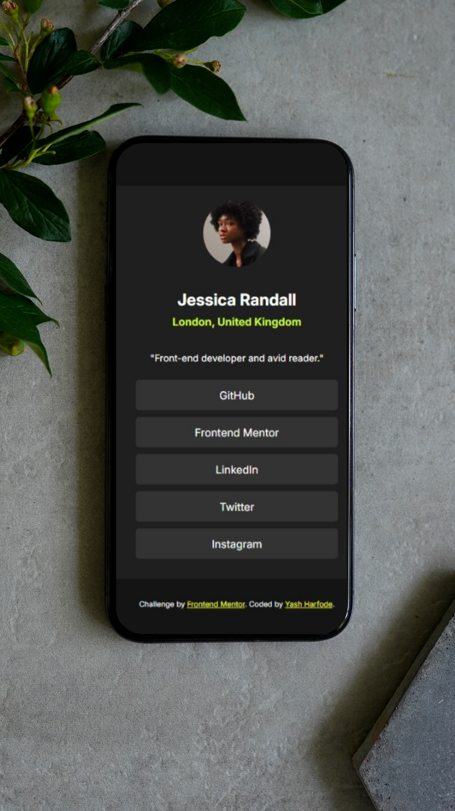

# Frontend Mentor - Social links profile solution 🎯

This is my solution to the [Social links profile challenge on Frontend Mentor](https://www.frontendmentor.io/challenges/social-links-profile-UG32l9m6dQ). It’s a static user card layout featuring styled profile details and interactive social links. I built this as part of my practice in refining responsive layouts and styling techniques using plain HTML and CSS.

---

## 📸 Screenshot

---

## 🔗 Links

- 🔧 **Solution Repository**: [github.com/YashHarfode/Frontend-Mentor-Social-links-profile](https://github.com/YashHarfode/Frontend-Mentor-Social-links-profile)
- 🌐 **Live Site**: [yashharfode.github.io/Frontend-Mentor-Social-links-profile](https://yashharfode.github.io/Frontend-Mentor-Social-links-profile)

---

## 🛠️ My Process

### Built With

- Semantic HTML5 markup
- CSS custom properties
- Flexbox layout
- Mobile-first approach

---

### What I Learned

- Implementing `:hover` states with color transitions on button-like elements
- Fine-tuning layout spacing, especially between name and location with margin control
- Applying custom color palettes using HSL tokens for design consistency

---

### Challenges Faced

- The spacing between `h2` (name) and `h4` (location) was visually off; I learned to adjust margins precisely to align typography and preserve the design’s compactness.
- Button hover styles were tuned to match the interactive cue without overpowering the background.

---

### Continued Development

No additional features planned at the moment — keeping it true to the original design for this challenge.

---

## 👤 Author

- 🚀 Portfolio: [yashharfode.netlify.app](https://yashharfode.netlify.app)
- 🧑‍💻 Frontend Mentor: [@YashHarfode](https://www.frontendmentor.io/profile/YashHarfode)
- 💼 LinkedIn: [Yash Harfode](https://www.linkedin.com/in/yash-harfode-32a836223/)

---

## 🙌 Acknowledgments

Thanks to the Frontend Mentor community and the challenge guides for helping sharpen my layout and styling intuition. The project was built independently with self-led iteration and styling.

---
